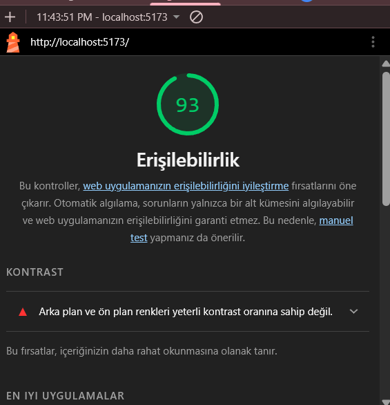

# Web LAB-2: Semantik HTML ve Erişilebilirlik (Ally)

Bu proje, Web Tasarımı ve Programlama dersi LAB-2 kapsamında bir web sayfasının semantik yapısını doğru kurma, erişilebilirlik standartlarını (WCAG) uygulama ve form yönetimi temellerini öğrenmek amacıyla geliştirilmiştir.

## 👤 Geliştirici Bilgileri
- **Ad Soyad:** Yunus Fırat
- **Öğrenci No:** 230541007
- **Bölüm:** Yazılım Mühendisliği

## 🚀 Proje Kapsamında Yapılanlar
Bu laboratuvar çalışmasında aşağıdaki kriterler başarıyla uygulanmıştır:

- **Semantik HTML5 Yapısı:** Sayfa; [cite_start]`<header>`, `<nav>`, `<main>`, `<section>`, `<article>` ve `<footer>` etiketleri kullanılarak anlamlı bir yapıya kavuşturulmuştur[cite: 73, 101, 670].
- [cite_start]**Heading Hiyerarşisi:** Erişilebilirlik için `<h1>`'den başlayarak ardışık ve mantıklı bir başlık düzeni (h1 -> h2 -> h3) kurulmuştur[cite: 191, 201, 671].
- [cite_start]**Erişilebilirlik (Ally) Özellikleri:** - Tüm görsellere anlamlı `alt` metinleri eklenmiştir[cite: 241, 672].
    - [cite_start]Sayfa içi erişimi hızlandıran "Ana içeriğe atla" (Skip Navigation) bağlantısı eklenmiştir[cite: 330, 677].
    - [cite_start]Navigasyon alanları `aria-label` ile etiketlenmiştir[cite: 316].
    - [cite_start]Klavye ile gezinme (Tab Navigation) desteği sağlanmış ve `focus` göstergesi optimize edilmiştir[cite: 298, 561, 676].
- [cite_start]**Form Doğrulama ve Erişilebilirlik:** - Tüm form elemanları `htmlFor` ve `id` ile ilişkili `label` etiketlerine sahiptir[cite: 385, 673].
    - [cite_start]`required`, `minlength` ve `type="email"` gibi HTML5 yerleşik doğrulama öznitelikleri kullanılmıştır[cite: 414, 674].
    - [cite_start]Hata mesajı alanları `role="alert"` ile erişilebilir hale getirilmiştir[cite: 433, 505, 675].

## 📊 Lighthouse Erişilebilirlik Testi
[cite_start]Projenin erişilebilirlik puanı Google Lighthouse aracı ile ölçülmüş ve **90+** puan hedefine ulaşılmıştır[cite: 607, 619, 679].

**Lighthouse Rapor Ekran Görüntüsü:**


## 🛠️ Kullanılan Teknolojiler
- React 18
- TypeScript
- Vite
- Semantik HTML5 & CSS3

## 💻 Kurulum ve Çalıştırma
1. Bağımlılıkları yükleyin:
   ```bash
   npm install